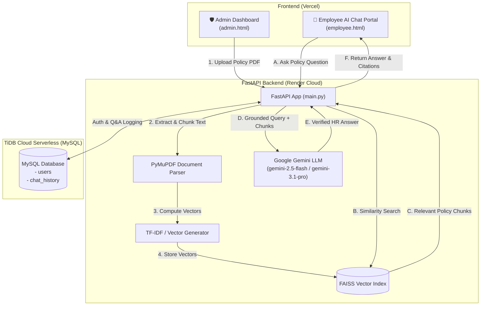

# 🤖 AI-Powered HR Policy Assistant (RAG System)

[](https://fastapi.tiangolo.com/)
[](https://www.python.org/)
[](https://aistudio.google.com/)
[](https://github.com/facebookresearch/faiss)
[](https://tidbcloud.com/)
[](https://render.com/)
[](https://vercel.com/)

A production-grade, full-stack **Retrieval-Augmented Generation (RAG)** application that allows employees to ask natural language questions about company HR policies and receive accurate, grounded, and instant answers powered by **Google Gemini** and **FAISS Vector Search**. 

Includes a dedicated **Admin Management Portal** for live document vectorization, employee analytics, and administrator management.

---

## 🌐 Live Production Links

| Resource | URL |
| :--- | :--- |
| 💻 **Frontend Web Application** | [https://hr-policy-assistant-eight.vercel.app](https://hr-policy-assistant-eight.vercel.app) |
| ⚙️ **Backend REST API** | [https://hr-policy-assistant-486o.onrender.com](https://hr-policy-assistant-486o.onrender.com) |
| 📖 **Interactive Swagger Docs** | [https://hr-policy-assistant-486o.onrender.com/docs](https://hr-policy-assistant-486o.onrender.com/docs) |

### 🔑 Demo Login Credentials

- **Admin Account**: `admin@company.com` | Password: `admin123`
- **Employee Account**: Create any new account via [Register Page](https://hr-policy-assistant-eight.vercel.app/register.html)

---

## 🏗️ System Architecture



---

## ✨ Key Features

- **📄 Dynamic Policy Ingestion**: Upload multi-page HR policy documents (PDF) with instant text extraction, intelligent paragraph chunking, and vector indexing.
- **🎯 Grounded RAG AI Q&A**: Employees can query policies in plain English (or regional inquiries) and receive precise answers strictly sourced from company documents.
- **🛡️ Role-Based Access Control (RBAC)**:
  - **Employee**: Conversational AI assistant with real-time suggestions and personal chat history tracking.
  - **Admin**: Policy document management, live knowledge base updates, vector telemetry, and internal tester simulator.
- **👥 In-App Admin Management**: Secure, authorized creation of additional administrator accounts directly from the dashboard.
- **☁️ Cloud-Native & Scalable**:
  - Backend deployed on **Render** (Python / Uvicorn).
  - Frontend deployed on **Vercel** with global CDN caching.
  - Relational persistence in **TiDB Cloud Serverless MySQL** with connection pooling and TLS encryption.
- **⚡ Ultra Low RAM Footprint (<60 MB)**: Engineered with lightweight deterministic vectorization to run seamlessly on cost-effective cloud tiers without OOM crashes.

---

## 🛠️ Tech Stack

### **Backend**
- **Language & Framework**: Python 3.11+, FastAPI, Uvicorn, Gunicorn
- **Generative AI**: Google GenAI SDK (`google-genai`), Gemini 2.5/3.1
- **Vector Search & Indexing**: FAISS (`faiss-cpu`), NumPy
- **Document Processing**: PyMuPDF (`fitz`)
- **ORM & Database**: SQLAlchemy 2.0, PyMySQL, Cryptography, Certifi
- **Security & Authentication**: Passwords hashed with `bcrypt` (Bcrypt gensalt)

### **Frontend**
- **Core**: HTML5, Modern CSS3 (Glassmorphism, Responsive Grid, CSS Variables)
- **JavaScript**: Vanilla ES6+ (Async/Await, Fetch API, LocalStorage Session State)
- **Icons & Badges**: SVG and Unicode Emoji iconography

### **Infrastructure & Cloud**
- **Hosting**: Render (Web Service), Vercel (Static Web Hosting)
- **Database**: TiDB Cloud Serverless (MySQL 8.0 compatible)
- **Version Control**: Git & GitHub

---

## 📁 Project Directory Structure

```text
fastapi_basic/
├── backend/
│   ├── faiss_db/               # Vector index storage
│   │   ├── hr_policy.index     # FAISS index binary
│   │   └── chunks.json         # Policy text chunks metadata
│   ├── services/
│   │   ├── chunk_storage.py    # Chunk persistence helpers
│   │   ├── embedding_service.py# Deterministic vectorizer
│   │   ├── faiss_service.py    # FAISS index creation & search
│   │   ├── gemini_service.py   # Google Gemini LLM grounding
│   │   └── pdf_service.py      # PyMuPDF text extractor
│   ├── uploads/                # Active and uploaded policy PDFs
│   ├── .env.example            # Environment variables template
│   ├── database.py             # SQLAlchemy DB engine & connection pooling
│   ├── main.py                 # FastAPI API routes & business logic
│   ├── Procfile                # Deployment start script for Render
│   └── requirements.txt        # Production Python dependencies
├── frontend/
│   ├── css/
│   │   └── style.css           # Modern unified styling & responsive theme
│   ├── js/
│   │   ├── admin.js            # Admin dashboard logic & policy upload
│   │   ├── config.js           # API Base URL dynamic resolver
│   │   ├── login.js            # Authentication & role routing
│   │   ├── register.js         # User registration handler
│   │   └── script.js           # Employee chat logic & history
│   ├── admin.html              # Administrator Control Center
│   ├── employee.html           # Employee AI Chat Dashboard
│   ├── index.html              # Landing / Welcome Page
│   ├── login.html              # User Authentication Portal
│   └── register.html           # User Registration Portal
├── .gitignore                  # Git ignore rules
└── README.md                   # Project documentation
```

---

## 🚀 Local Setup & Installation

### 1. Clone Repository
```bash
git clone https://github.com/rohanshinde8080/HR-policy-assistant.git
cd HR-policy-assistant
```

### 2. Configure Backend Environment
Navigate to the `backend` directory and create your `.env` file:
```bash
cd backend
```

Create a `.env` file with your credentials:
```env
GEMINI_API_KEY=your_google_gemini_api_key_here
DATABASE_URL=mysql+pymysql://<user>:<password>@<host>:4000/test
```

> **Note**: Obtain a free Gemini API Key from [Google AI Studio](https://aistudio.google.com/app/apikey).

### 3. Install Dependencies
```bash
python -m venv env
# On Windows:
.\env\Scripts\activate
# On macOS/Linux:
source env/bin/activate

pip install -r requirements.txt
```

### 4. Run Backend Server
```bash
uvicorn main:app --reload --host 127.0.0.1 --port 8000
```
API will start running at: `http://127.0.0.1:8000`  
Swagger Documentation: `http://127.0.0.1:8000/docs`

### 5. Run Frontend
Open `frontend/index.html` in your browser (e.g. using VS Code **Live Server** on port `5500`/`5501`).

---

## 📡 API Endpoints Summary

| Method | Endpoint | Description | Access |
| :--- | :--- | :--- | :--- |
| `POST` | `/register` | Register a new Employee account | Public |
| `POST` | `/login` | Authenticate user & return role/session | Public |
| `POST` | `/create-admin` | Create a new Admin account | Admin Only |
| `POST` | `/upload-policy` | Upload & re-index new HR Policy PDF | Admin Only |
| `GET` | `/current-policy` | Fetch metadata of active policy | Authenticated |
| `GET` | `/view-policy/{file}` | View/download active policy PDF | Authenticated |
| `POST` | `/ask` | Ask HR question & receive Gemini answer | Authenticated |
| `GET` | `/chat-history/{id}`| Retrieve user's previous Q&A history | Authenticated |

---

## 🤝 Contributing

Contributions, issues, and feature requests are welcome!  
Feel free to check the [Issues page](https://github.com/rohanshinde8080/HR-policy-assistant/issues).

---

## 📄 License

This project is licensed under the **MIT License** — see the [LICENSE](LICENSE) file for details.

---

### 👨‍💻 Developed by
**Rohan Shinde**  
GitHub: [@rohanshinde8080](https://github.com/rohanshinde8080)

